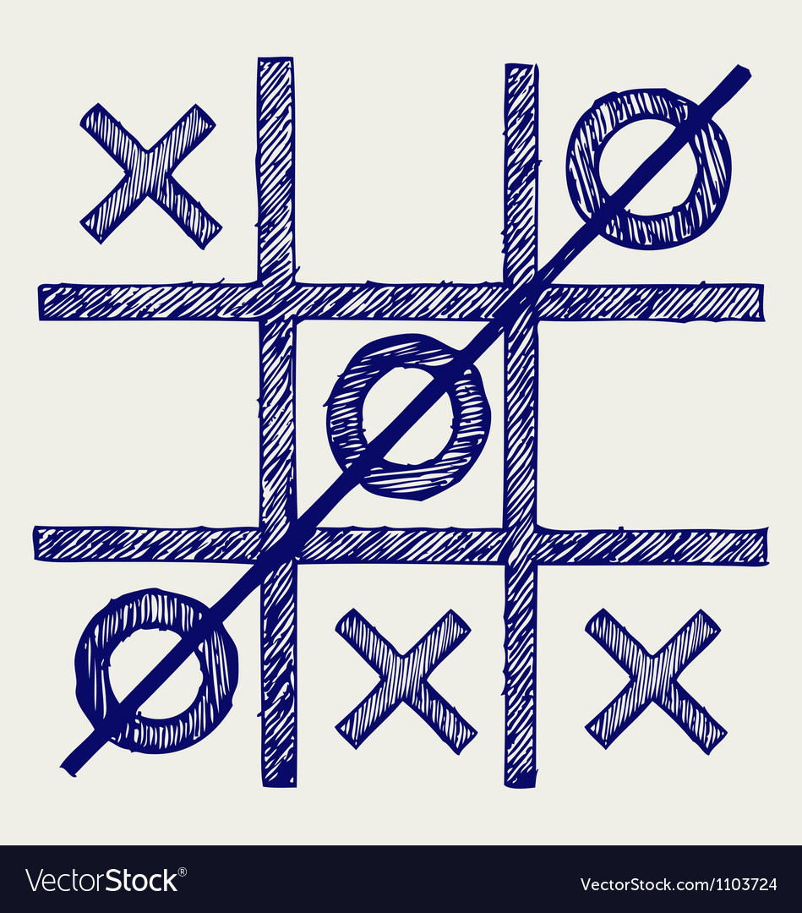

# CHALLANGE004
Tic-Tac-Toe(XOXO)

Create a xoxo game that cam be played between two palyers (X) and (0)

## TIP:

game can be should be command line based

## INFO
tic-tac-toe is a game that involves two players each taking turns to play. (X) when the x's form a ***straight line in any direction*** the same applies for (O).

Here are some images:

